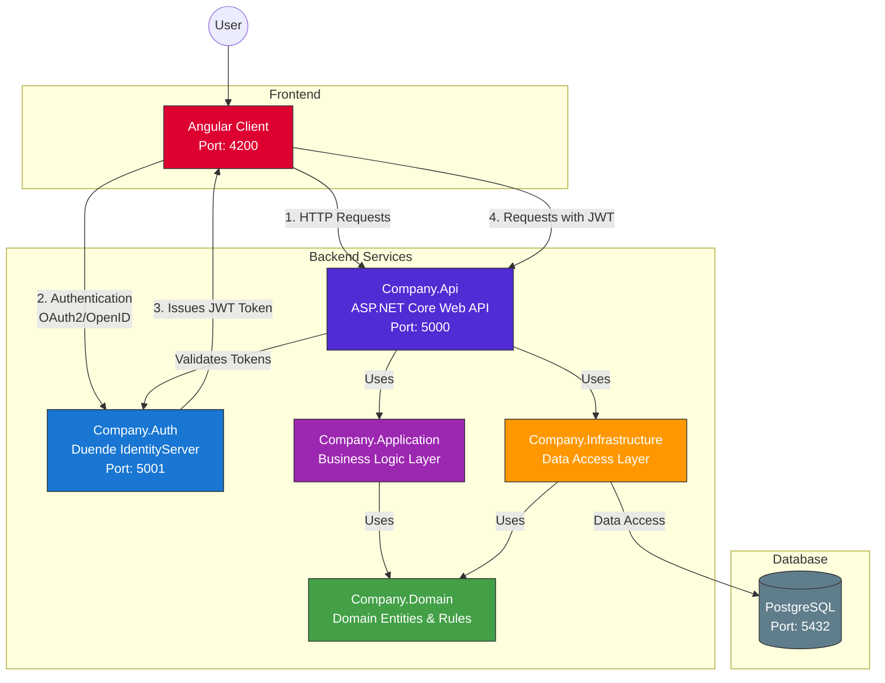

# Company Service

A modern .NET 9-based RESTful API for managing company information, secured with Duende IdentityServer, and integrated with an Angular frontend. This solution uses Docker Compose to orchestrate all services for seamless development and deployment.

[](https://dotnet.microsoft.com/)
[](https://angular.io/)
[](https://www.docker.com/)

## Table of Contents

- [Architecture Overview](#architecture-overview)
- [Prerequisites](#prerequisites)
- [Getting Started](#getting-started)
  - [Running with Docker Compose](#running-with-docker-compose)
  - [Local Development](#local-development)
- [Authentication & Authorization](#authentication--authorization)
  - [Testing with Swagger UI](#testing-with-swagger-ui)
- [API Endpoints](#api-endpoints)
- [Database Management](#database-management)
  - [Entity Framework Core Migrations](#entity-framework-core-migrations)
  - [Manual Database Setup](#manual-database-setup)
- [Testing and Code Coverage](#testing-and-code-coverage)
- [Project Structure](#project-structure)
- [Configuration](#configuration)
  - [Environment Variables](#environment-variables)
  - [appsettings.json](#appsettingsjson)
  - [Logging Configuration](#logging-configuration)
- [Troubleshooting](#troubleshooting)
- [Extending the Project](#extending-the-project)
- [License](#license)

## Architecture Overview



The solution follows clean architecture principles with the following components:

- **Company.Domain**: Core business entities and rules with no external dependencies
- **Company.Application**: Business logic that depends only on the Domain layer
- **Company.Infrastructure**: Data access and external services that implement interfaces defined in Domain
- **Company.Api**: Web API layer that brings everything together and provides endpoints
- **Company.Auth**: Duende IdentityServer (OAuth2/OpenID Connect provider)
- **Company.Tests**: Test projects for unit and integration testing
- **Client**: Angular 20 SPA with Material UI

This architecture ensures a clear separation of concerns with dependencies flowing inward toward the Domain layer, eliminating circular dependencies.

## Prerequisites

- [Docker](https://www.docker.com/products/docker-desktop/) and [Docker Compose](https://docs.docker.com/compose/install/)
- [.NET 9.0 SDK](https://dotnet.microsoft.com/download/dotnet) (for local development)
- [Node.js](https://nodejs.org/) v18+ and npm (for client app development)
- [PostgreSQL](https://www.postgresql.org/download/) (only for local development without Docker)

## Getting Started

### Running with Docker Compose

The easiest way to run the complete solution is using Docker Compose:

1. Clone the repository:
   ```sh
   git clone https://github.com/aleksandarandjelkovic/GL-CompanyService.git
   cd CompanyService
   ```

2. Build and start all services:
   ```sh
   docker-compose up --build
   ```

3. Access the services:
   - **Angular Client**: http://localhost:4200
   - **API Swagger UI**: http://localhost:5000/swagger
   - **IdentityServer**: http://localhost:5001
   - **PostgreSQL**: localhost:5432 (credentials in docker-compose.yml)

4. To stop all services:
   ```sh
   docker-compose down
   ```

5. To remove volumes (database data) when stopping:
   ```sh
   docker-compose down -v
   ```

### Local Development

For development without Docker:

1. Update connection strings in `appsettings.Development.json` files in both API and Auth projects
2. Start the Auth server:
   ```sh
   cd Company.Auth
   dotnet run
   ```

3. Start the API:
   ```sh
   cd Company.Api
   dotnet run
   ```

4. Start the Angular client:
   ```sh
   cd client
   npm install
   npm start
   ```

## Authentication & Authorization

- The API uses JWT Bearer authentication with tokens issued by IdentityServer
- Default configured flows:
  - **Client Credentials flow**: For service-to-service API access
  - **Authorization Code with PKCE**: For the Angular SPA client

### Testing with Swagger UI

1. Open Swagger UI at http://localhost:5000/swagger
2. Click "Authorize" button
3. Use the following client credentials:
   - **Client ID**: `swagger`
   - **Client Secret**: `secret`
4. Click "Authorize" to authenticate
5. Now you can test any API endpoint with the obtained token

## API Endpoints

All endpoints require a valid JWT access token.

| Method | Endpoint | Description |
|--------|----------|-------------|
| GET | `/api/companies` | Get all companies |
| GET | `/api/companies/{id}` | Get a specific company by ID |
| GET | `/api/companies/isin/{isin}` | Get a company by ISIN |
| POST | `/api/companies` | Create a new company |
| PUT | `/api/companies/{id}` | Update an existing company |

## Database Management

### Entity Framework Core Migrations

Migrations are automatically applied when the application starts in Docker. For manual management:

1. Apply existing migrations:
   ```sh
   cd Company.Api
   dotnet ef database update --project ../Company.Infrastructure
   ```

2. Create a new migration:
   ```sh
   cd Company.Api
   dotnet ef migrations add MigrationName --project ../Company.Infrastructure
   ```

3. Generate SQL script:
   ```sh
   cd Company.Api
   dotnet ef migrations script --project ../Company.Infrastructure --output ../Company.Infrastructure/Migrations/script.sql
   ```

### Manual Database Setup

To manually set up the database schema:

1. Ensure PostgreSQL is running
2. Connect to your database using pgAdmin, DBeaver, or psql
3. Run the SQL script:
   ```sh
   psql -U postgres -d CompanyServiceDb -f Scripts/InitialCreate.sql
   ```

## Testing and Code Coverage

The solution includes comprehensive unit and integration tests using xUnit.

### Running Tests
```sh
dotnet test
```

### Generating Code Coverage Reports
```sh
dotnet test --collect:"XPlat Code Coverage"
reportgenerator -reports:"Company.Tests\TestResults\*\coverage.cobertura.xml" -targetdir:"coveragereport" -reporttypes:Html
```

After generating the report, open `coveragereport\index.html` in your browser to view coverage metrics.

## Project Structure

```
CompanyService/
├── Company.Api/            # API endpoints, controllers, and configuration
├── Company.Auth/           # IdentityServer implementation
├── Company.Application/    # Business logic, DTOs, and validation
├── Company.Domain/         # Domain entities and business rules
├── Company.Infrastructure/ # Data access and persistence
├── Company.Tests/          # Unit and integration tests
├── client/                 # Angular frontend application
├── docker-compose.yml      # Docker Compose configuration
├── wait-for-it.sh          # Helper script for Docker service dependencies
└── README.md               # This file
```

## Configuration

### Environment Variables

- **AUTH_AUTHORITY**: URL of the IdentityServer (configured in docker-compose.yml)
- **POSTGRES_DB**: Database name
- **POSTGRES_USER**: Database username
- **POSTGRES_PASSWORD**: Database password
- **ASPNETCORE_ENVIRONMENT**: Development/Staging/Production

### appsettings.json

Key configuration options in appsettings.json files:

- **ConnectionStrings**: Database connection strings
- **Serilog**: Logging configuration
- **IdentityServer**: Auth server configuration

### Logging Configuration

The solution uses Serilog for structured logging, with configuration centralized in the Company.Api project. Log settings can be found in:

- `Company.Api/appsettings.json` - The main logging configuration
- `Company.Api/Extensions/LoggingExtensions.cs` - Serilog setup code

Logs are written to both the console and rolling file logs in the `Logs` directory.

## Troubleshooting

### Common Issues

1. **Docker containers fail to start**
   - Check Docker logs: `docker-compose logs [service-name]`
   - Ensure ports 5000, 5001, 4200, and 5432 are not in use by other applications
   - Try rebuilding with `docker-compose up --build`

2. **Database connection issues**
   - Verify PostgreSQL is running: `docker-compose ps postgres`
   - Check connection strings in appsettings.json
   - Ensure database migrations are applied

3. **Authentication problems**
   - Verify the Auth server is running at http://localhost:5001
   - Check that AUTH_AUTHORITY environment variable is correctly set
   - Ensure client configurations in Company.Auth match your needs

4. **Angular app errors**
   - Check browser console for errors
   - Verify proxy configuration in client/proxy.conf.json
   - Ensure npm dependencies are installed: `npm install`

## Extending the Project

1. Add new entities to the Domain project
2. Update or add DbContext configurations in the Infrastructure project
3. Create DTOs and services in the Application project
4. Add controllers to the API project
5. Register new API scopes/clients in the Auth server as needed
6. Add new components and services to the Angular client

## License

[MIT License](LICENSE)

Copyright (c) 2025 Aleksandar Andjelkovic

Permission is hereby granted, free of charge, to any person obtaining a copy of this software and associated documentation files (the "Software"), to deal in the Software without restriction, including without limitation the rights to use, copy, modify, merge, publish, distribute, sublicense, and/or sell copies of the Software, and to permit persons to whom the Software is furnished to do so, subject to the following conditions:

The above copyright notice and this permission notice shall be included in all copies or substantial portions of the Software.

THE SOFTWARE IS PROVIDED "AS IS", WITHOUT WARRANTY OF ANY KIND, EXPRESS OR IMPLIED, INCLUDING BUT NOT LIMITED TO THE WARRANTIES OF MERCHANTABILITY, FITNESS FOR A PARTICULAR PURPOSE AND NONINFRINGEMENT. IN NO EVENT SHALL THE AUTHORS OR COPYRIGHT HOLDERS BE LIABLE FOR ANY CLAIM, DAMAGES OR OTHER LIABILITY, WHETHER IN AN ACTION OF CONTRACT, TORT OR OTHERWISE, ARISING FROM, OUT OF OR IN CONNECTION WITH THE SOFTWARE OR THE USE OR OTHER DEALINGS IN THE SOFTWARE. 